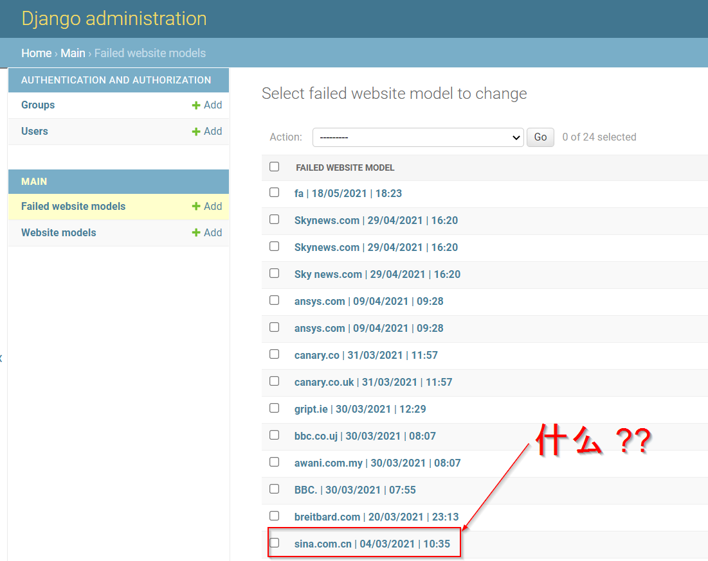

# Bright News (backend)

## Intro

Django backend for a web app that analyses the positivity of a news site. Links to...

- [live site](https://mihailthebuilder.github.io/bright-news-web-frontend/)
- [frontend repo](https://github.com/mihailthebuilder/bright-news-web-frontend)

## Table of contents

- [Bright News (backend)](#bright-news-backend)
  - [Intro](#intro)
  - [Table of contents](#table-of-contents)
  - [Back-end architecture](#back-end-architecture)
  - [Views](#views)
  - [Models](#models)
  - [Scoring process](#scoring-process)
    - [Fetching the raw data](#fetching-the-raw-data)
    - [Data cleansing](#data-cleansing)
    - [Absolute scoring](#absolute-scoring)
    - [Relative scoring](#relative-scoring)
  - [DevOps](#devops)
    - [Setting up the environment](#setting-up-the-environment)
    - [Running locally](#running-locally)
  - [License](#license)

## Back-end architecture

The back-end is a Django RESTful API hosted on Heroku's free tier. It's completely separate from the front-end and the codebase sits in this repo.

## Views

There's only 1 view in this Django project and it corresponds to the API endpoint that connects to the front-end. It receives the URL of the news site and returns the analysis data. I leverage [Django REST framework](https://www.django-rest-framework.org/) to set up this view using the generic `APIView` class.

## Models

2 models that database all the site submissions together with the data generated from my analysis:

1. `WebsiteModel` - sites that were successfully analysed
2. `FailedWebsiteModel` - sites where the back-end couldn't successfully send analysis results back to the front-end

This enables me to see all the data in my Django admin panel and discover gems 😄


## Scoring process

### Fetching the raw data

The scoring process starts by going to the URL that has been sent to the API. Upon successful entry, it uses [Beautiful Soup](https://www.crummy.com/software/BeautifulSoup/bs4/doc/) to fetch all the text and splits it into a `list` according to their HTML elements.

### Data cleansing

I remove any text piece that meets any of the following criteria:

- Includes site-generic terms such as "cookie" or "sign up".
- Doesn't have enough words; the sentiment model struggles to analyse them.
- Are duplicates

I also apply some encoding/decoding black magic using the `text_transform` function to remove odd characters.

### Absolute scoring

I selected the [VADER](https://github.com/cjhutto/vaderSentiment) and [AFINN](https://github.com/fnielsen/afinn) sentiment analysis libraries for generating my site positivity scores. Both are well-known in the NLP space. I tested them on a few samples as well; they seem to be quite reliable and complementary of each other.

I go through each piece of text and compare the scores generated by the two libraries. The aggregate score is based on several situations:

1. Both scores are of the same sign -> aggregate score is +1.
2. One score is 0 while another is non-0 -> aggregate score is +/-1 depending on the sign of the score.
3. The two scores are of opposite signs -> aggregate score is 0 because the models seem unreliable.
4. The two scores are 0 -> aggregate score is again 0.

You'll notice I convert all scores to +/-1 and 0; using the actual magnitudes didn't produce reliable results for me.

Finally, I calculate the entire site's **absolute** score by dividing the number of (+1) text pieces by the number of non-0 text pieces. But we're not done yet :)

### Relative scoring

I retrieve all the absolute scores that are stored in the `WebsiteModel` and add the site-in-focus' score to the list. I then use [pandas](https://pandas.pydata.org/) to group them by the mean values for each URL.

With [scikit learn](https://scikit-learn.org/), I scale all the scores so that they're between 0 and 1. 0 represents the least positive score in our `pandas` dataframe, while 1 represents the most positive score.

This scaled dataset is what's sent back to the front-end for the wonderful results page. The end 🥳

## DevOps

### Setting up the environment

```bash
python3 -m venv venv
source venv/bin/activate
pip install -r requirements.txt
```

You might encounter issues with installing `psycopg2` on Linux (Ubuntu). Run the below as per the [installation guide](https://www.psycopg.org/docs/install.html#build-prerequisites) and [this](https://stackoverflow.com/questions/26053982/setup-script-exited-with-error-command-x86-64-linux-gnu-gcc-failed-with-exit#comment95142671_33874511):

```bash
sudo apt-get install python3-dev libpq-dev build-essential
export PATH=/usr/lib/postgresql/X.Y/bin/:$PATH
```

### Running locally

```bash
export DJANGO_ENV=development
python manage.py runserver
```

## License

Licensed under [Mozilla Public License 2.0](LICENSE).
